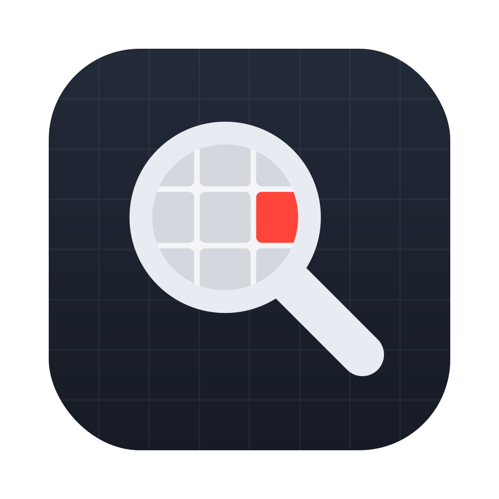
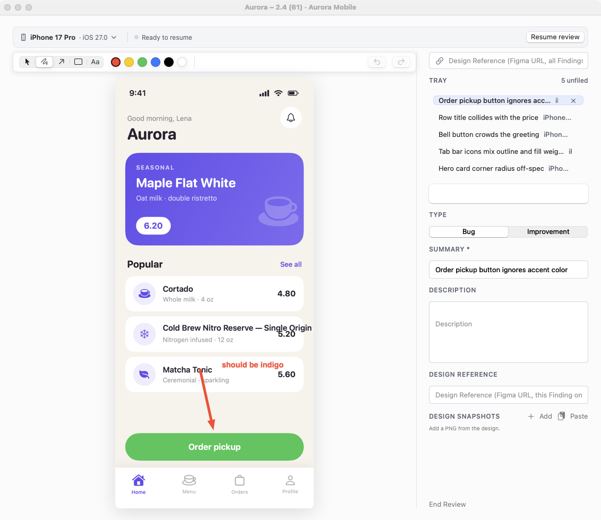

<p align="center">
  
</p>

<h1 align="center">nitpick</h1>

<p align="center">A macOS companion app for design review of mobile apps.</p>

nitpick closes the loop between design and implementation: a designer reviews a build in the iOS simulator, captures what's on screen, annotates it, and files each finding as a YouTrack issue — without leaving the review flow.



## How a review works

1. **Start a Review Session** — pick the build under review and the YouTrack project once; every Finding captured in the session shares that context.
2. **Capture** (⌘S) — grab the screen of the booted simulator or a mirroring window (iPhone Mirroring, Bezel). Each Finding is stamped with its Device Context: device model, OS version, and the accessibility settings in effect at capture (Dynamic Type, Dark Mode, Increase Contrast).
3. **Annotate and describe** — pen, arrow, rectangle, and text labels over the screenshot, plus a description, type (Bug or Improvement), priority, and assignee. Design Snapshots from Figma can sit alongside the capture for reference.
4. **File** — each Finding becomes exactly one YouTrack issue, annotated screenshot and metadata included. Your history of filed sessions stays local.

## Install

Grab `Nitpick.app` from the [releases](https://github.com/Jonathanm10/nitpick/releases); updates ship through Sparkle. Requires macOS 15+.

## Development

```sh
make run    # swift run — the dev flow
make test
make icon   # regenerate assets/AppIcon.icns from assets/icon.svg
```

`make help` lists the full signed-release ladder (documented in [docs/release.md](docs/release.md)). The domain language lives in [CONTEXT.md](CONTEXT.md), architecture decisions in [docs/adr](docs/adr/).
